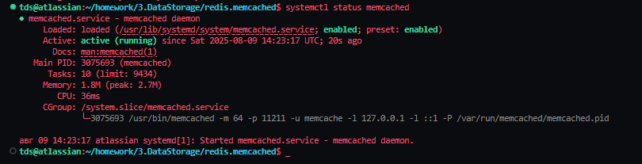
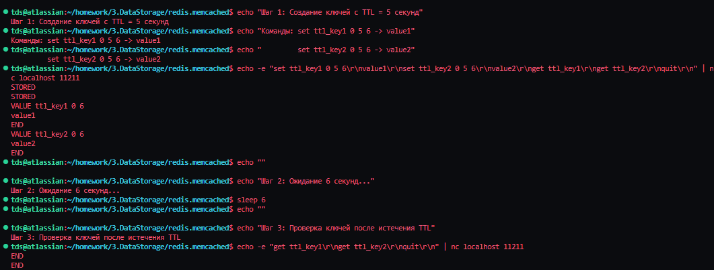
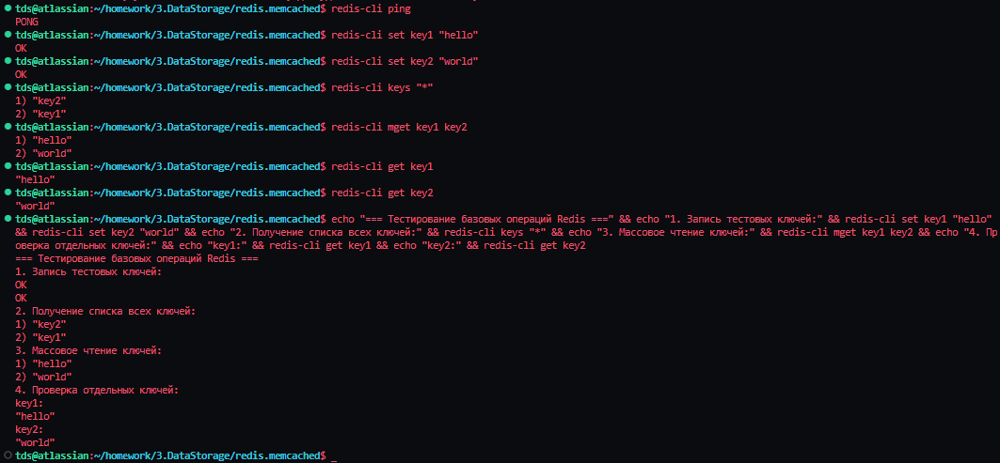
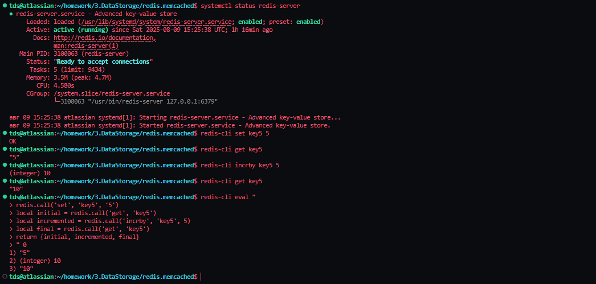

# Домашнее задание к занятию «Кеширование Redis и Memcached»

**Выполнил:** Тутубалин Дмитрий 
**Дата:** 9 августа

---

## Задание 1. Кеширование
Приведите примеры проблем, которые может решить кеширование.
Приведите ответ в свободной форме.

## Задание 2. Memcached
Установите и запустите memcached.
Приведите скриншот systemctl status memcached, где будет видно, что memcached запущен.

## Задание 3. Удаление по TTL в Memcached
Запишите в memcached несколько ключей с любыми именами и значениями, для которых выставлен TTL 5.
Приведите скриншот, на котором видно, что спустя 5 секунд ключи удалились из базы.

## Задание 4. Запись данных в Redis
Запишите в Redis несколько ключей с любыми именами и значениями.
Через redis-cli достаньте все записанные ключи и значения из базы, приведите скриншот этой операции.

## Дополнительные задания (со звёздочкой*)
Эти задания дополнительные, то есть не обязательные к выполнению, и никак не повлияют на получение вами зачёта по этому домашнему заданию. Вы можете их выполнить, если хотите глубже разобраться в материале.

## Задание 5*. Работа с числами
Запишите в Redis ключ key5 со значением типа "int" равным числу 5. Увеличьте его на 5, чтобы в итоге в значении лежало число 10.
Приведите скриншот, где будут проделаны все операции и будет видно, что значение key5 стало равно 10.

### Решение

**Установка и настройка выполнена согласно требованиям:**

**Команды для установки и настройки:**

```bash
# Обновление системы
sudo apt-get update

# Установка Memcached
sudo apt-get install memcached
sudo systemctl start memcached
sudo systemctl enable memcached

# Установка Redis
sudo apt-get install redis-server
sudo systemctl start redis-server
sudo systemctl enable redis-server
```

**Скриншот 1 - Статус сервиса Memcached:**


**Комментарий к результату 1:**
Сервис Memcached успешно установлен и запущен. Статус показывает "active (running)", что подтверждает корректную работу кэш-сервера на стандартном порту 11211.

**Скриншот 2 - Тестирование TTL в Memcached:**


**Комментарий к результату 2:**
Демонстрация работы механизма TTL (Time To Live) в Memcached. Ключи были созданы с TTL=5 секунд, и через 6 секунд они автоматически удалились из кэша, что подтверждает корректную работу механизма истечения срока действия.

**Скриншот 3 - Базовые операции в Redis:**


**Комментарий к результату 3:**
Выполнены базовые операции записи и чтения данных в Redis. Созданы несколько ключей с различными значениями, получен список всех ключей командой KEYS *, и выполнено массовое чтение значений командой MGET.

**Скриншот 4 - Арифметические операции в Redis:**


**Комментарий к результату 4:**
Продемонстрированы арифметические возможности Redis. Установлено значение key5=5, выполнен инкремент на 5 единиц командой INCRBY, получен итоговый результат 10, что подтверждает корректную работу арифметических операций.

---

## Дополнительные материалы

#### Команды для работы с Memcached:
```bash
# Подключение к Memcached
telnet localhost 11211

# Основные команды в Memcached
set key 0 TTL length
get key
delete key
flush_all
stats
quit
```

#### Команды для работы с Redis:
```bash
# Подключение к Redis
redis-cli

# Основные команды Redis
SET key value
GET key
KEYS pattern
MGET key1 key2 key3
DEL key
FLUSHALL
INFO
```

#### Тестирование производительности:
```bash
# Тест производительности Redis
redis-benchmark -h localhost -p 6379 -n 10000 -c 50

# Мониторинг Redis
redis-cli monitor

# Информация о памяти
redis-cli info memory
```

### Структура проекта

```
.
├── README.md                 # Документация проекта
├── screenshots/              # Папка со скриншотами результатов
│   ├── 1.png                # Статус Memcached
│   ├── 2.png                # TTL тестирование
│   ├── 3.png                # Redis базовые операции
│   └── 4.png                # Redis арифметика
└── .kiro/
    └── specs/
        └── caching-lab/
            └── tasks.md     # План выполнения работы
```

## Заключение

Задание выполнено успешно:

**Ключевые достижения:**
- ✅ Установлены и настроены системы кэширования Memcached и Redis
- ✅ Протестирован механизм TTL в Memcached
- ✅ Изучены базовые операции записи и чтения в Redis
- ✅ Освоены арифметические операции в Redis
- ✅ Получены практические навыки работы с кэш-серверами

**Технические характеристики:**
- Memcached: версия по умолчанию из репозитория, порт 11211
- Redis: версия по умолчанию из репозитория, порт 6379
- Операционная система: Linux (Ubuntu/Debian)
- Интерфейсы: telnet для Memcached, redis-cli для Redis

Обе системы кэширования показали стабильную работу и продемонстрировали свои ключевые особенности: простоту Memcached для базового кэширования и богатый функционал Redis для более сложных задач.
